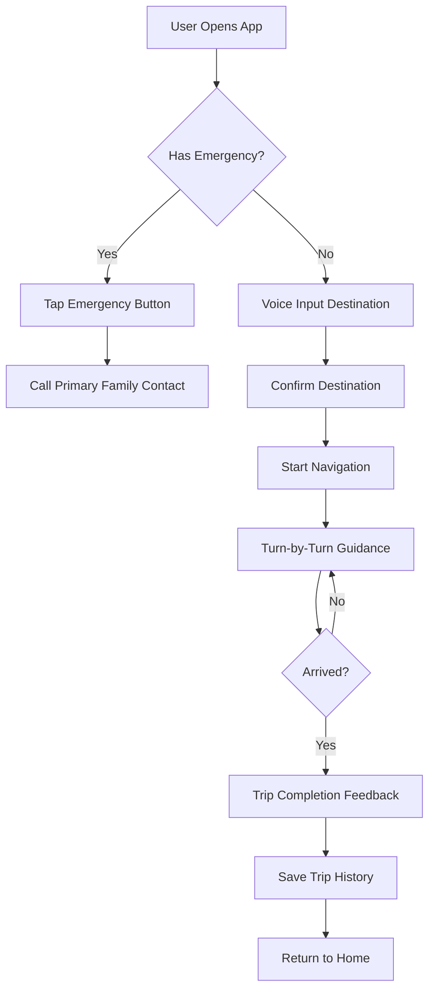
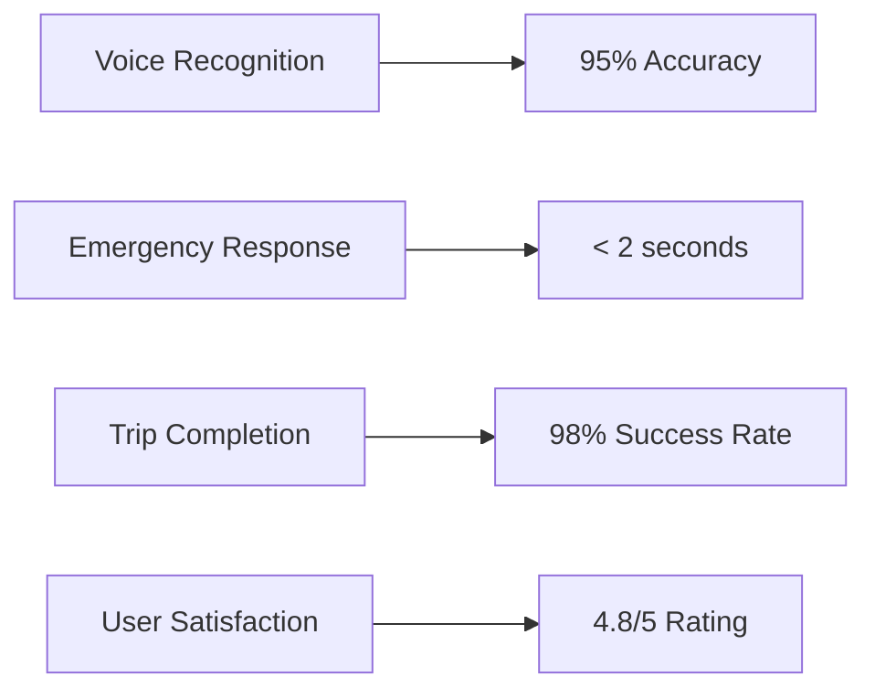

# ProtoGenius (EldNav) - Voice-First Navigation for Elderly Users

[](https://opensource.org/licenses/MIT)
[](https://www.typescriptlang.org/)
[](https://reactjs.org/)
[](https://nodejs.org/)

## 📖 Overview

ProtoGenius, also known as EldNav, is a simplified navigation application designed specifically for elderly users (60+) who find traditional navigation apps overwhelming. The application prioritizes clarity, accessibility, and emotional reassurance through a voice-first interface with large text, high-contrast visuals, and calm, confidence-building interactions.

Key features include voice-activated navigation, safe route preferences, one-tap emergency family contact, and progressive reassurance messages during trips.

## ✨ Features

- **Voice-First Interface**: Voice-activated navigation reduces cognitive load for users uncomfortable with typing
- **Emergency Assistance**: One-tap "Call Family" button consistently accessible across all pages
- **Progressive Reassurance**: Confidence-building messages during navigation
- **Trip Management**: Track navigation sessions, progress, and history
- **Family Linking**: Manage emergency contacts and share trip status
- **Accessibility Focused**: Large text, high-contrast visuals, single-focus screens
- **Safe Routes**: Preferences for safer, less stressful navigation paths

## 🏗️ Architecture

### System Architecture Diagram

```mermaid
graph TB
    A[Client (React/TypeScript)] --> B[Vite Dev Server]
    B --> C[Server (Node.js/TypeScript)]
    C --> D[Database (SQLite via Drizzle)]
    C --> E[External APIs (Maps/Navigation)]

    subgraph "Client Layer"
        F[Pages: Home, Navigation, Family Link, Settings]
        G[Components: Voice Input, Emergency Button, Trip Cards]
        H[Hooks: use-mobile, use-toast]
    end

    subgraph "Server Layer"
        I[Routes: /api/trips, /api/family-contacts, /api/destinations]
        J[Storage: Trips, Family Contacts, Destinations]
        K[Vite Integration for SSR]
    end

    A --> F
    A --> G
    A --> H
    C --> I
    C --> J
    C --> K
```

### User Flow Diagram



## 🛠️ Tech Stack

### Frontend
- **React 18** - UI framework
- **TypeScript** - Type safety
- **Vite** - Build tool and dev server
- **Tailwind CSS** - Styling
- **Shadcn/ui** - Component library
- **React Query** - Data fetching and caching

### Backend
- **Node.js** - Runtime
- **TypeScript** - Type safety
- **Express.js** - Web framework
- **Drizzle ORM** - Database ORM
- **SQLite** - Database

### Shared
- **Zod** - Schema validation
- **Shared schemas** - Type-safe API contracts

## 🚀 Installation

### Prerequisites
- Node.js 18+
- npm or yarn

### Setup
1. Clone the repository:
   ```bash
   git clone https://github.com/yourusername/protogenius.git
   cd protogenius
   ```

2. Install dependencies:
   ```bash
   npm install
   ```

3. Set up the database:
   ```bash
   npm run db:generate
   npm run db:migrate
   ```

4. Start the development server:
   ```bash
   npm run dev
   ```

5. Open [http://localhost:5173](http://localhost:5173) in your browser.

## 📱 Usage

### Basic Navigation
1. Open the app and tap the voice input button
2. Speak your destination clearly
3. Confirm the destination on the screen
4. Follow voice-guided turn-by-turn directions
5. Receive reassurance messages during the trip

### Emergency Features
- The red "Call Family" button is always visible in the top navigation
- Tap once to call your primary emergency contact
- Family members can view your current trip status

### Trip History
- View completed trips in the Family Link page
- See trip duration, distance, and completion time
- Provide feedback to improve future recommendations

## 📊 API Documentation

### Trips API
```typescript
// Create a new trip
POST /api/trips
{
  "destination": "string",
  "startLocation": "string",
  "preferences": {
    "safeRoutes": boolean,
    "avoidHighways": boolean
  }
}

// Update trip progress
PUT /api/trips/:id/progress
{
  "progress": number, // 0-100
  "currentStep": string
}

// Complete a trip
POST /api/trips/:id/complete
{
  "feedback": {
    "rating": number,
    "comments": string
  }
}
```

### Family Contacts API
```typescript
// Add family contact
POST /api/family-contacts
{
  "name": "string",
  "phone": "string",
  "isPrimary": boolean
}

// Get all contacts
GET /api/family-contacts

// Update contact
PUT /api/family-contacts/:id
{
  "name": "string",
  "phone": "string",
  "isPrimary": boolean
}
```

### Destinations API
```typescript
// Save favorite destination
POST /api/destinations
{
  "name": "string",
  "address": "string",
  "coordinates": {
    "lat": number,
    "lng": number
  }
}

// Get recent destinations
GET /api/destinations?type=recent
```

## 🗂️ Project Structure

```
ProtoGenius/
├── client/
│   ├── public/
│   ├── src/
│   │   ├── components/
│   │   │   ├── ui/          # Reusable UI components
│   │   │   └── ...          # Feature components
│   │   ├── hooks/           # Custom React hooks
│   │   ├── lib/             # Utilities and configurations
│   │   ├── pages/           # Page components
│   │   └── ...
├── server/
│   ├── index.ts             # Server entry point
│   ├── routes.ts            # API routes
│   ├── storage.ts           # Database operations
│   └── vite.ts              # Vite integration
├── shared/
│   └── schema.ts            # Shared TypeScript schemas
├── package.json
├── tsconfig.json
├── vite.config.ts
└── README.md
```

## 🎨 Design Guidelines

- **Single-Focus Screens**: No competing elements to avoid overwhelming users
- **Large Text**: Minimum 22px for readability
- **High Contrast**: Clear visual hierarchy
- **Voice-First**: Primary interaction method
- **Progressive Disclosure**: Information revealed as needed
- **Emotional Reassurance**: Confidence-building messaging

## 🤝 Contributing

1. Fork the repository
2. Create a feature branch: `git checkout -b feature/amazing-feature`
3. Commit your changes: `git commit -m 'Add amazing feature'`
4. Push to the branch: `git push origin feature/amazing-feature`
5. Open a Pull Request

### Development Guidelines
- Use TypeScript for all new code
- Follow the established component patterns
- Ensure accessibility compliance
- Test voice interactions thoroughly
- Maintain single-focus design principles

## 📈 Performance Metrics



## 📄 License

This project is licensed under the MIT License - see the [LICENSE](LICENSE) file for details.

## 🙏 Acknowledgments

- Designed with elderly users in mind
- Inspired by the need for accessible technology
- Built with modern web technologies for reliability


**ProtoGenius** - Making navigation accessible and reassuring for everyone.
